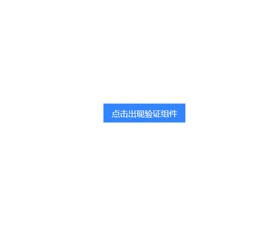

# 滑动验证

canvas滑动验证码 使用jquery写的组件。

> 你可以在网址查看需要 接口返回的相关数据格式 

# 使用效果



# 项目特色
- 使用typescript语言编写搭建
- 已在线上运行
- 完美支持移动端与PC端
- 需要服务器端支持

# 使用方法

```js
import Jqsv from 'jqsv'
import 'jqsv/es/common.css'
const app = document.getElementById('app')
const xhrDataMock = await fetchData(Date.now())
const JqsvConfig = {
  data: xhrDataMock,
  refresh(updateComponentData) {
    refreshData(Date.now()).then((data) => updateComponentData(data))
  },
  submit({ vaildToken, requestToken, timespan, point }, callback) {
    // featch 模拟服务器验证过程 
    if (point > 83 && point < 100) {
      callback().then(() => {
        // do something,such as login
      })
    } else {
      callback('校验值与实际值出现误差')
    }
  }
}

let instance = null

app.addEventListener('click', async function () {
  if (instance === null) return new Jqsv(JqsvConfig, el)
  if (instance.state === 'loaded') {
    instance.show()
  } else {
    instance = new Jqsv(JqsvConfig, el)
  }
})
```

关于`JqsvConfig`，这是一个配置对象，该对象的属性为

| 属性名  | 类型     | 是否必填 | 说明                                             |
| ------- | -------- | -------- | ------------------------------------------------ |
| data    | object   | 必须传入 | 组件数据                                         |
| refresh | function | 必须传入 | 当组件刷新时调用函数，你你应该在这里刷新组件数据 |
| close   | function | 可选     | 组件关闭后的钩子函数                             |
| submit  | function | 必须传入 | 组件滑动后提交用的调用函数                       |

关于`data`对象，需要说明一下他的属性
| 属性名     | 类型     | 是否必填 | 说明                                                                                         |
| ---------- | -------- | -------- | -------------------------------------------------------------------------------------------- |
| imgWidth   | number   | 是       | 背景图片宽度                                                                                 |
| imgHeight  | number   | 是       | 背景图片高度                                                                                 |
| normal     | string   | 是       | 背景图片(base64)字符串                                                                       |
| small      | string   | 是       | 拼图图片(base64)字符串                                                                       |
| array      | number[] | 是       | 乱序数组，服务器将[0...19]这个数组乱序后，对原图片进行切割，前端代码根据该乱序数组将图片还远 |
| locationY  | number   | 是       | 拼图初始化位置                                                                               |
| validToken | string   | 是       | 拼图提交验证时凭证，服务器会维护一个{validToken,value}的验证，根据该validToken验证提交参数   |

例如 : 
```js
export const data1 = {
  imgWidth: 260,
  imgHeight: 160,
  normal:
    'data:image/jpg;base64,/9j/4AAQSkZJRgABAQAAAQABAAD/...',
  small:
    'data:image/jpg;base64,/9j/4AAQSkZJRgABAQAAAQABAAD/...',
  array: [15, 13, 12, 5, 4, 7, 1, 17, 3, 8, 0, 11, 9, 2, 16, 6, 18, 14, 10, 19],
  locationY: 35,
  validToken: '9c619f596a504ccbaf18e86fb2e09352'
}
```


# 项目运行

```js
npm install
npm run dev 
npm run build 
```

# 业务流程图


